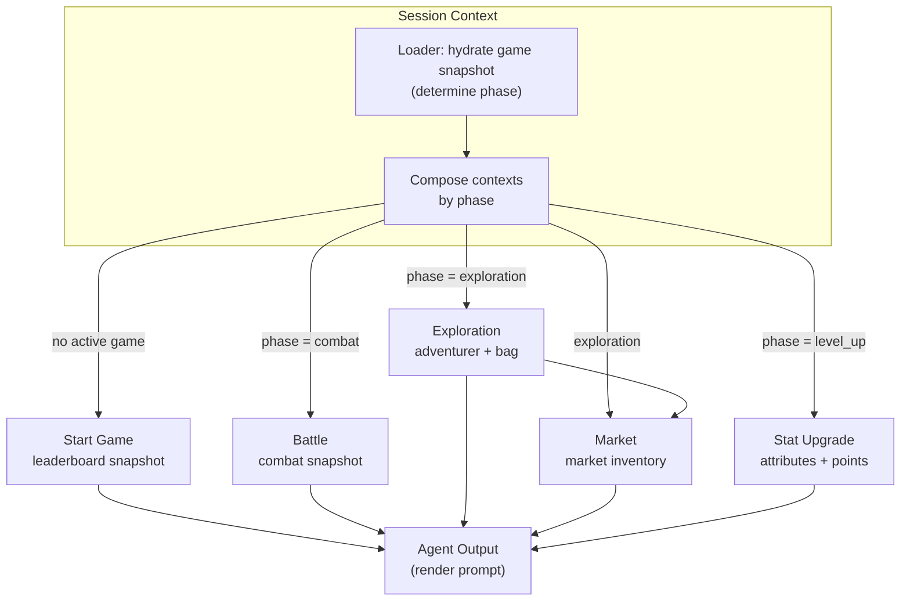

# Loot Survivor Agent (Daydreams)

Daydreams-powered orchestration layer that prepares Loot Survivor game state via loader-driven contexts before handing control to the language model. The agent focuses on curating data; the LLM stays responsible for planning and decisions.

## Context Architecture

- `session` — entry point; inspects the player/game phase and composes the rest of the contexts.
- `startGame` — onboarding snapshot with leaderboard/tips when no active run exists.
- `battle` — current combat state, including adventurer stats, beast info, and combat preview.
- `exploration` — non-combat readiness plus bag contents.
- `market` — market inventory with the subset that is currently affordable, plus derived potion pricing.
- `statUpgrade` — available stat points and current attribute spread.

Each context defines a `loader` that pulls fresh data before the model generates a response, eliminating the need for explicit fetch actions such as “get_state” or “get_player_status”.

## Data Flow



## Dependencies & Shared Services

- `@daydreamsai/core`, `@daydreamsai/ai-sdk-provider`, `@daydreamsai/chromadb` (installed via `bun install`).
- Shared game-state wrapper in `agent/src/services/gameState.ts`, which reuses `engine/src/services/GameStateService.ts` for Torii queries.
- Optional environment overrides:
  - `TORII_URL` — Torii endpoint (defaults to `https://api.cartridge.gg/x/boat-ls2-mainnet-v2/torii`).
  - `NAMESPACE` — database namespace (defaults to `ls_0_0_9`).
  - `DEFAULT_GAME_ID` — preferred adventurer id for loader hydration (defaults to `21603`).

## Running Locally

```bash
bun install

# From repo root; provide a player id, optional game id, and optional prompt
#   (game id defaults to 21603 if omitted)
bun run index.ts boat 21603 "Summarize current state only."
```

The CLI boots the agent, lets each loader prefetch state, then prints the model output. Ensure the `engine` module (sharing `GameStateService`) has access to the same Torii endpoint or mocked data so loaders can hydrate successfully.
