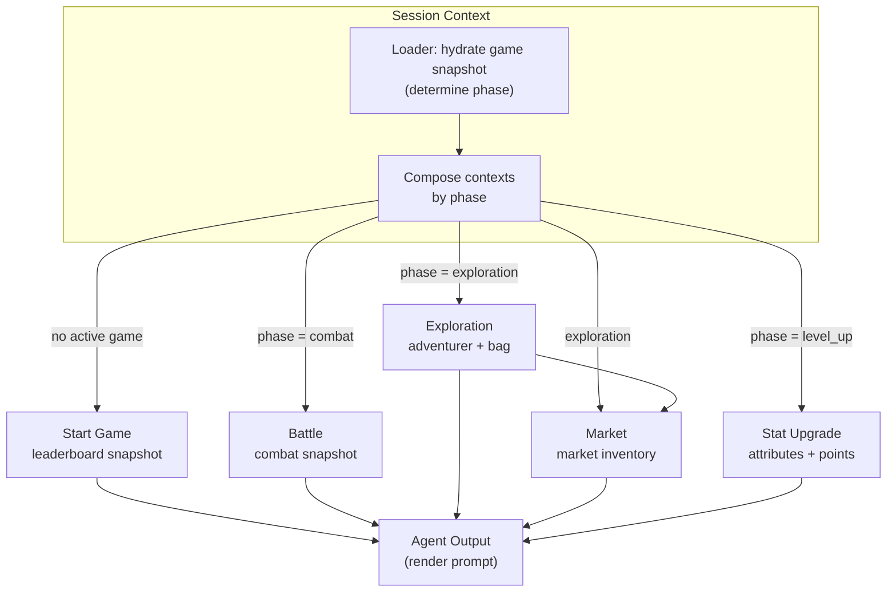

# Loot Survivor Agent (Daydreams)

Daydreams-powered orchestration layer that prepares Loot Survivor game state via loader-driven contexts before handing control to the language model. The agent focuses on curating data; the LLM stays responsible for planning and decisions.

## Context Architecture

- `session` — entry point; inspects the player/game phase and composes the rest of the contexts.
- `startGame` — onboarding snapshot with leaderboard/tips when no active run exists.
- `battle` — current combat state, including adventurer stats, beast info, and combat preview.
- `exploration` — non-combat readiness plus bag contents.
- `market` — market inventory with the subset that is currently affordable, plus derived potion pricing.
- `statUpgrade` — available stat points and current attribute spread.

Each context defines a `loader` that pulls fresh data before the model generates a response, eliminating the need for explicit fetch actions.

### On-Chain Actions

- `systemCallsService` boots a Cartridge session and exposes a connected Starknet account for action handlers.
- `src/actions/systemCalls.ts` wraps the service so contexts can invoke on-chain moves such as `explore`, `attack`, `flee`, `buy-items`, `select-stat-upgrades`, and `claim-beast`.
- Actions are scoped to the contexts where they make sense (battle, exploration, stat-upgrade, session), keeping the LLM’s toolbox aligned with the player’s phase.

## Data Flow



## Dependencies & Shared Services

- Optional environment overrides:
  - `TORII_URL` — Torii endpoint (defaults to `https://api.cartridge.gg/x/boat-ls2-mainnet-v2/torii`).
  - `NAMESPACE` — database namespace (defaults to `ls_0_0_9`).
  - `DEFAULT_GAME_ID` — preferred adventurer id for loader hydration (defaults to `21603`).

## Running Locally

```bash
bun install && bun run index.ts boat 21603 "Summarize current state only."
```
